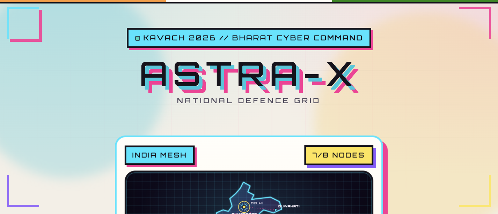
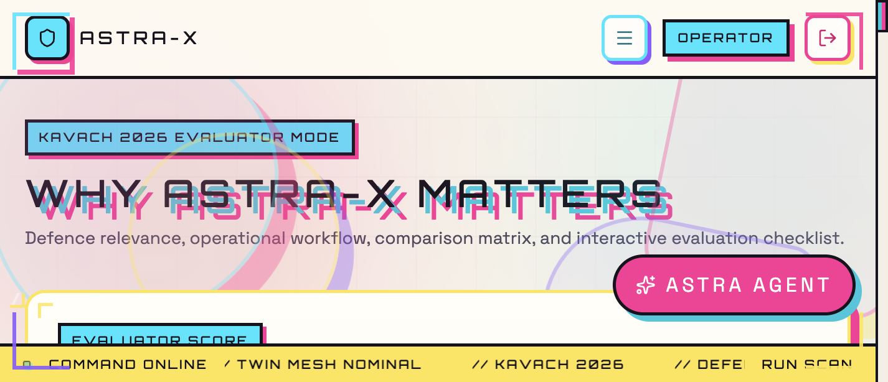
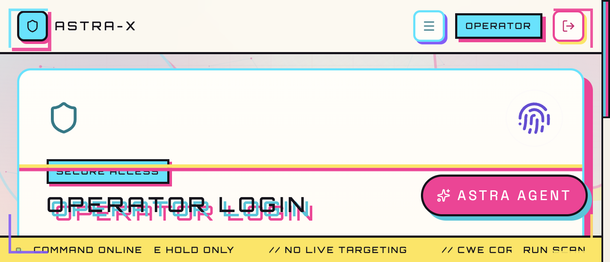
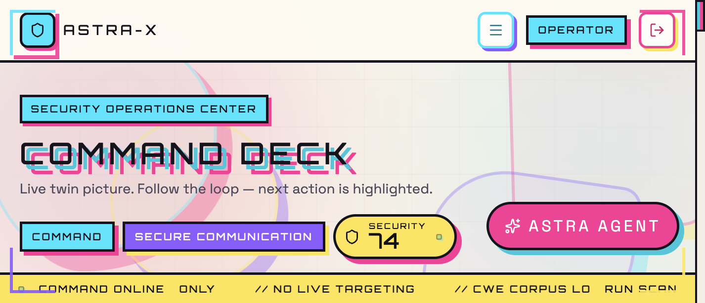
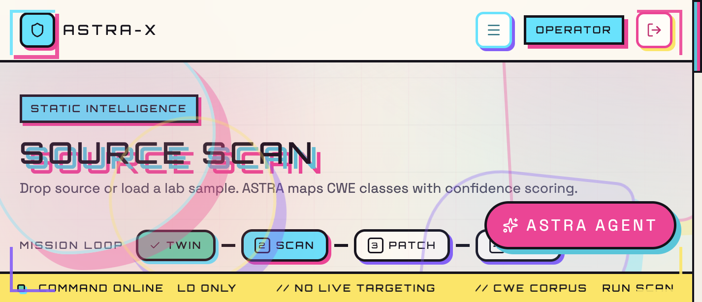
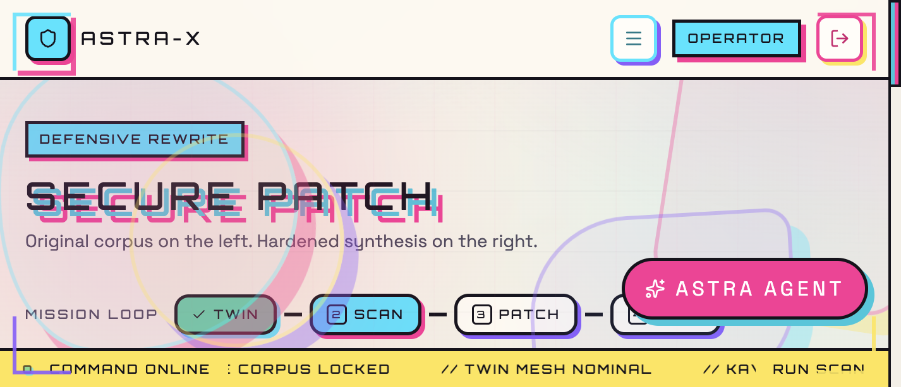
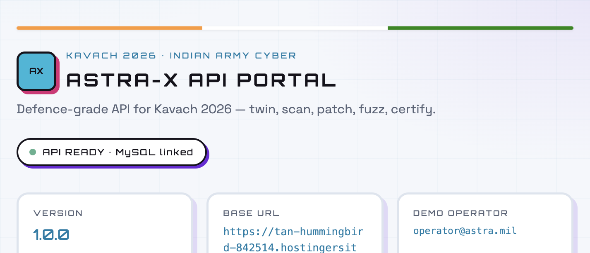
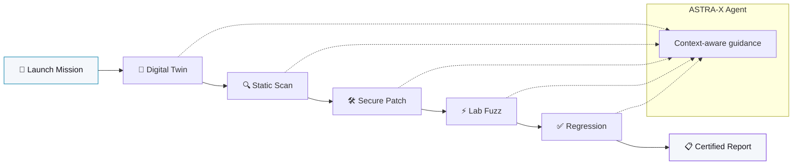
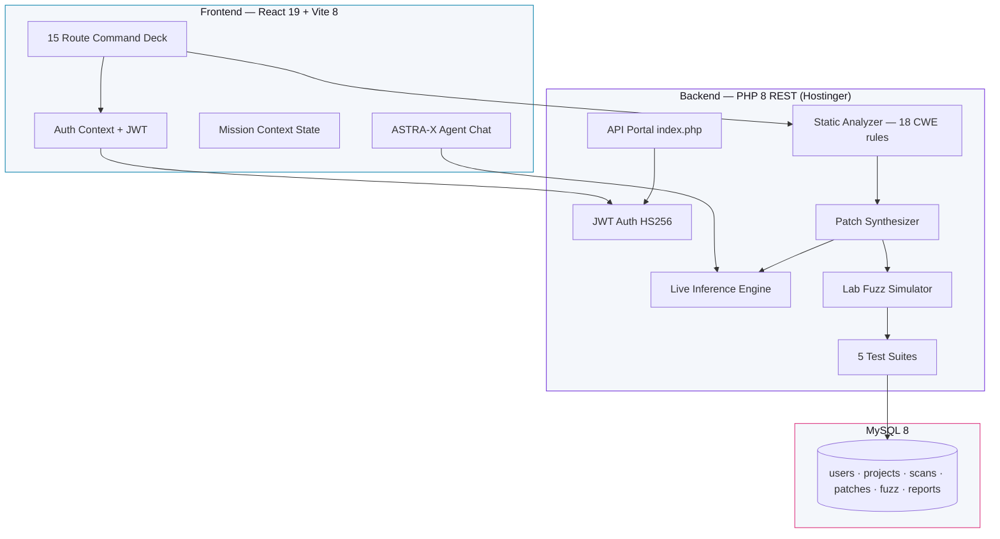
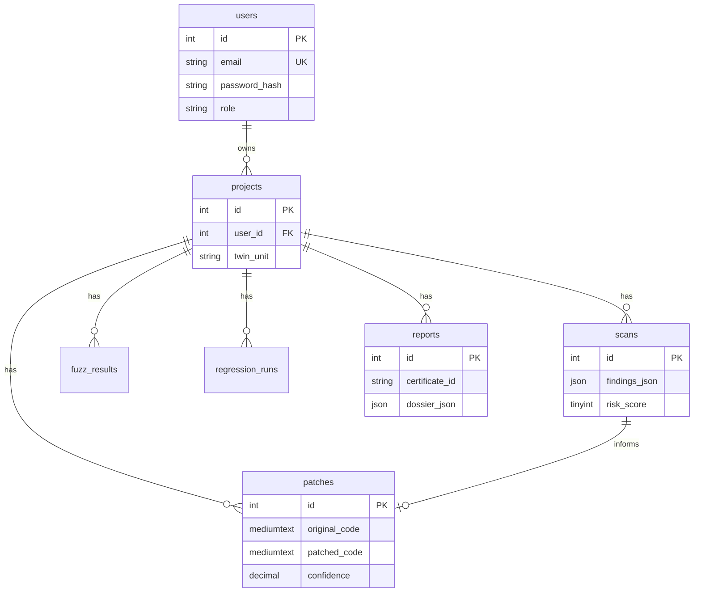

<div align="center">

# 🛡️ ASTRA-X

### Autonomous Security Tactical Reasoning Agent

**Defence-grade AI command platform · Kavach 2026 · Indian Army Cyber Demonstration**

[](https://astra-x-ai-kavach-2026.vercel.app/)
[](https://tan-hummingbird-842514.hostingersite.com/)
[](https://react.dev/)
[](https://vitejs.dev/)
[](https://php.net/)
[](https://mysql.com/)
[](https://tailwindcss.com/)

**Scan · Patch · Certify · Never weaponize**

[🚀 Live Demo](https://astra-x-ai-kavach-2026.vercel.app/) · [⚡ API Portal](https://tan-hummingbird-842514.hostingersite.com/) · [GitHub](https://github.com/Priyadarshan2000/Astra-X-AI-Kavach-2026) · [Screenshots](#-screenshots--ui-tour) · [5-Min Walkthrough](#-reviewer--interviewer-walkthrough-5-min) · [Interview Q&A](#-interview-talking-points)

<br/>

<p align="center">
  
  <br/>
  <em>Landing command brief — India mesh map, theatre nodes, mission CTAs</em>
</p>

<br/>

| | |
| --- | --- |
| **Demo login** | `operator@astra.mil` / `AstraX#2026` |
| **Stack** | React 19 · PHP 8 REST · MySQL 8 · JWT · Live AI inference |
| **Scale** | 15 routes · 12 API endpoints · 5 languages · 18+ CWE rules · ~7,500 LOC |

</div>

---

## 📑 Table of Contents

- [Executive Summary](#-executive-summary)
- [Screenshots & UI Tour](#-screenshots--ui-tour)
- [The Problem We Solve](#-the-problem-we-solve)
- [Why ASTRA-X Stands Out](#-why-astra-x-stands-out)
- [Live Deployments](#-live-deployments)
- [Reviewer / Interviewer Walkthrough (5 min)](#-reviewer--interviewer-walkthrough-5-min)
- [Mission Loop](#-mission-loop)
- [System Architecture](#-system-architecture)
- [Technical Deep Dive](#-technical-deep-dive)
- [Frontend Engineering](#-frontend-engineering)
- [Database Design](#-database-design)
- [API Reference](#-api-reference)
- [API Testing (curl · Postman · Smoke Script)](#-api-testing-curl--postman--smoke-script)
- [Security & Defensive Doctrine](#-security--defensive-doctrine)
- [Interview Talking Points](#-interview-talking-points)
- [Engineering Decisions](#-engineering-decisions)
- [Local Development](#-local-development)
- [Deployment Pipeline](#-deployment-pipeline)
- [Project Structure](#-project-structure)
- [Roadmap](#-roadmap)

---

## 🎯 Executive Summary

**ASTRA-X** is a **production-deployed, full-stack defence cyber platform** built for **Kavach 2026** evaluators. It demonstrates how an AI copilot can secure mission-critical field software — from **digital twin deployment** through **CWE-mapped static analysis**, **bounded secure rewrites**, **lab fuzz validation**, and **certified after-action reports** — while maintaining strict **defensive-only doctrine**.

This is not a mock UI or slide deck. It is a **live, end-to-end system**:

| Layer | Live URL | What runs |
| --- | --- | --- |
| **Command Deck** | [astra-x-ai-kavach-2026.vercel.app](https://astra-x-ai-kavach-2026.vercel.app/) | React 19 SPA on Vercel |
| **REST API** | [tan-hummingbird-842514.hostingersite.com](https://tan-hummingbird-842514.hostingersite.com/) | PHP 8 on Hostinger |
| **Database** | MySQL 8 (Hostinger) | Users, projects, scans, patches, reports |
| **AI Agent** | Server-side inference | Context-aware mission guidance + patch analysis |

**One-liner for evaluators:**

> *ASTRA-X takes mission software from digital twin → CWE scan → AI-guided secure patch → lab fuzz → regression certification — with live JWT auth, MySQL persistence, and a tactical agent that reads real mission state.*

---

## 📸 Screenshots & UI Tour

> **Visual proof for interviewers** — every screen below is from the live build. Click through at [astra-x-ai-kavach-2026.vercel.app](https://astra-x-ai-kavach-2026.vercel.app/).

### Command Deck (Frontend)

<table>
<tr>
<td width="50%" valign="top">

**Landing · Mission Brief**

Cinematic hero, India defence mesh, live theatre nodes, and four CTAs — Live Demo, GitHub, Watch Demo, Incident Sim.

<p align="center"></p>

</td>
<td width="50%" valign="top">

**Judge Mode · Evaluator Checklist**

Built for Kavach reviewers — comparison matrix, architecture layers, vuln cards, and interactive evaluation checklist.

<p align="center"></p>

</td>
</tr>
<tr>
<td width="50%" valign="top">

**Operator Login · JWT Auth**

Army Cyber Command clearance gate. Pre-filled demo credentials. Falls back to offline session if API is unreachable.

<p align="center"></p>

</td>
<td width="50%" valign="top">

**Command Deck · SOC Dashboard**

Live threat picture, AI confidence gauge, mission timeline, and highlighted next action in the mission loop.

<p align="center"></p>

</td>
</tr>
<tr>
<td width="50%" valign="top">

**Static Scan · CWE Intelligence**

Upload source or load lab sample. ASTRA maps CWE classes with line numbers, risk scores, and confidence.

<p align="center"></p>

</td>
<td width="50%" valign="top">

**Secure Patch · Defensive Rewrite**

Split-screen before/after synthesis. Mission loop progress bar tracks twin → scan → patch → fuzz → certify.

<p align="center"></p>

</td>
</tr>
</table>

### Backend API Portal

Light-theme API documentation served at the Hostinger root — live health status, endpoint cards, demo credentials, and curl smoke test.

<p align="center">
  
  <br/>
  <em>Self-hosted API portal · <a href="https://tan-hummingbird-842514.hostingersite.com/">tan-hummingbird-842514.hostingersite.com</a></em>
</p>

### Quick demo script (show these in order)

| # | Screen | Route | What to say |
| --- | --- | --- | --- |
| 1 | Landing + Incident Sim | `/` | *"30-second cyberattack simulation — detect, patch, restore"* |
| 2 | Login | `/login` | *"Real JWT auth against live MySQL backend"* |
| 3 | Scan sample | `/scan` | *"Load api_gateway.js — four CWE findings in one click"* |
| 4 | Patch analysis | `/patch` | *"ASTRA-X explains every rewrite with reviewer tips"* |
| 5 | Judge mode | `/judge` | *"Evaluator checklist — built for Kavach scoring"* |
| 6 | API portal | [live API](https://tan-hummingbird-842514.hostingersite.com/) | *"Full REST API — Postman + curl proof chain"* |

---

## 🔥 The Problem We Solve

Army field software — secure comms gateways, drone parsers, logistics APIs — often reaches theatre **without a unified assurance pipeline**. Teams use fragmented tools: one for scanning, another for patching, ad-hoc fuzzing, scattered logs. Reviewers lack a **single command deck** that proves defensive hold from twin to certificate.

### Before ASTRA-X

```
Manual review → siloed scanners → developer rewrites → limited testing → scattered evidence
```

### After ASTRA-X

```
Digital Twin → CWE Scan → Secure Patch → Lab Fuzz → Regression → Certified Report
         ↑________________ ASTRA-X Agent (context-aware guidance) ________________↑
```

| Pain Point | ASTRA-X Solution |
| --- | --- |
| Fragmented tooling | Unified mission loop with persistent state |
| No pre-deploy twin | Bharat defence mesh — clone before theatre |
| Opaque patch rationale | AI explains every rewrite — CWE, severity, reviewer tips |
| Weak reviewer evidence | Mission dossier + Postman/curl proof chain |
| Offensive risk in demos | Hard-coded defensive doctrine — no exploit generation |

---

## 🏆 Why ASTRA-X Stands Out

### For Kavach 2026 Judges

| Capability | Proof |
| --- | --- |
| **Live full stack** | Vercel frontend ↔ Hostinger PHP ↔ MySQL — not offline mock |
| **End-to-end loop** | Twin → Scan → Patch → Fuzz → Regression → Report with DB persistence |
| **CWE-mapped findings** | Line numbers, risk scores (0–100), confidence (0–1.0) |
| **AI patch analysis** | Every rewrite explained with reviewer hold tips |
| **Zero-install demo** | Login and run full mission in browser in under 5 minutes |
| **API proof chain** | Postman collection + automated smoke test script |
| **Judge mode** | Dedicated `/judge` route with checklist + comparison matrix |

### For Technical Interviewers

| Engineering Signal | Implementation |
| --- | --- |
| **Full-stack ownership** | React SPA + REST API + relational schema + production deploy |
| **Security-aware design** | JWT HS256, PDO prepared statements, CORS, secrets isolation |
| **Domain modeling** | Mission state machine, CWE taxonomy, confidence/risk metrics |
| **AI integration** | Server-side inference with rule-based fallback (graceful degradation) |
| **Performance UX** | Code-split routes, lazy 3D, GSAP scroll triggers, reduced-motion support |
| **DevOps** | Vercel CI, Hostinger packaging script, health checks, API portal |
| **Documentation** | Postman, curl recipes, smoke tests, deploy guide |

---

## 🌐 Live Deployments

### Frontend — Command Deck

| | |
| --- | --- |
| **URL** | [**https://astra-x-ai-kavach-2026.vercel.app/**](https://astra-x-ai-kavach-2026.vercel.app/) |
| **Clearance ID** | `operator@astra.mil` |
| **Passphrase** | `AstraX#2026` |

### Backend — REST API + MySQL

| | |
| --- | --- |
| **Base URL** | [**https://tan-hummingbird-842514.hostingersite.com**](https://tan-hummingbird-842514.hostingersite.com) |
| **API Portal** | [index.php](https://tan-hummingbird-842514.hostingersite.com/) — light-theme docs UI |
| **Health** | [health.php](https://tan-hummingbird-842514.hostingersite.com/health.php) → `"status": "ready"` |
| **JSON catalog** | [?format=json](https://tan-hummingbird-842514.hostingersite.com/?format=json) |

The Vercel frontend is wired to the live Hostinger API. Login issues real JWT tokens; scan, patch, and fuzz results persist to MySQL.

---

## 🎬 Reviewer / Interviewer Walkthrough (5 min)

Follow this path to evaluate the platform end-to-end:

```
Landing → Login → Digital Twin → Scan → Patch → Fuzz → Regression → Reports
```

| Step | Route | What to demonstrate |
| --- | --- | --- |
| **1. Mission briefing** | `/` | Cinematic boot, India mesh map, 3D shield, **Incident Sim** (30s cyberattack → restore) |
| **2. Operator login** | `/login` | JWT auth — pre-filled demo credentials |
| **3. Command deck** | `/dashboard` | Threat radar, attack fabric, AI confidence gauge, mission timeline |
| **4. Digital twin** | `/twin` | Arm Secure Comms / Drone Parser / Logistics API on Bharat mesh |
| **5. Static scan** | `/scan` | Upload or load sample — CWE findings with line numbers |
| **6. Secure patch** | `/patch` | Split-screen diff + **ASTRA-X analysis cards** (CWE, severity, tips) |
| **7. Lab fuzz** | `/fuzz` | Before/after attack-surface simulation |
| **8. Regression** | `/regression` | Five tactical suites lock green |
| **9. After-action** | `/reports` | Restricted mission dossier with certificate ID |
| **Judge mode** | `/judge` | Evaluator checklist, comparison matrix, architecture |
| **Evidence SOC** | `/evidence` | MITRE/OWASP mapping, severity charts |
| **Twin simulation** | `/simulation` | Defence network topology — click nodes for AI reasoning |

**Bonus — ASTRA-X Agent:** Open chat (bottom-right). Ask *"Mission status"*, *"What is next?"*, *"Kavach 2026 brief"* — live inference reads your route and mission context.

**Impress in 30 seconds:** Landing → **Incident Sim** → watch breach detect patch restore → **Live Demo** → Scan JavaScript sample → Patch → show ASTRA-X analysis card for CWE-95.

---

## 🔄 Mission Loop



| Phase | Action | Output |
| --- | --- | --- |
| **1. Launch** | Operator authenticates | JWT + session |
| **2. Twin** | Clone field unit into mesh | `project_id` in MySQL |
| **3. Scan** | Pattern engine maps CWE classes | Findings JSON + risk score |
| **4. Patch** | Bounded rewrite removes exec paths | Patched corpus + ASTRA analysis |
| **5. Fuzz** | Lab attack-surface simulation | Before/after bypass metrics |
| **6. Tests** | Five regression suites | Pass/fail per suite |
| **7. Report** | After-action dossier | Certificate ID `KAVACH-2026-ASTRA-*` |

Mission progress is tracked client-side (`MissionContext`) and server-side (MySQL rows per phase).

---

## 🏗️ System Architecture



### Request Flow — Scan → Patch → Report

```
Operator uploads source
    → POST /scan.php (JWT)
    → analyzer.php: regex rules × language filter
    → findings[] with line, CWE, risk, confidence
    → INSERT scans (findings_json, risk_score)
    → POST /patch.php
    → generate_patch(): bounded rewrites
    → POST /explain.php: ASTRA analysis cards
    → INSERT patches (original, patched, notes_json)
    → POST /fuzz.php → POST /regression.php
    → GET /reports.php → mission dossier
```

---

## 🔬 Technical Deep Dive

### Static Analyzer (`backend/includes/analyzer.php`)

Language-aware regex rule engine mapping findings to **CWE taxonomy** with line-level attribution.

| Language | Rules | Example CWEs |
| --- | --- | --- |
| **C / C++** | 6 | CWE-120 (buffer overflow), CWE-78 (command injection), CWE-134 (format string), CWE-242 (gets) |
| **Python** | 4 | CWE-502 (pickle), CWE-78, CWE-89 (SQLi), CWE-95 (eval) |
| **Java** | 2 | CWE-89, CWE-78 (Runtime.exec) |
| **JavaScript** | 6 | CWE-95 (eval), CWE-79 (XSS), CWE-78, CWE-89 |

Each finding includes:

```json
{
  "id": "VULN-013",
  "title": "Dynamic code execution",
  "cwe": "CWE-95",
  "severity": "critical",
  "risk": 98,
  "confidence": 0.97,
  "line": 4,
  "fix": "Remove eval; parse with JSON.parse or a schema validator."
}
```

**Risk score:** `100 - avg(finding.risk)` — higher is safer post-analysis.

### Patch Synthesizer

Deterministic, bounded rewrites — not generative exploit code:

| Vulnerable Pattern | Secure Replacement |
| --- | --- |
| `strcpy(` | `strncpy(` with bounds |
| `eval(` | `JSON.parse(` |
| `.innerHTML =` | `.textContent =` |
| `exec(cmd + user)` | `spawn(fixed, [args])` |
| SQL string concat | Parameterized placeholders |

Returns `confidence`, `risk_reduction`, and `notes[]` for reviewer audit trail.

### ASTRA-X AI Reasoning Engine (`backend/includes/ai.php`)

Server-side only — never exposed to client as third-party branding.

| Endpoint | Purpose | Fallback |
| --- | --- | --- |
| `POST /chat.php` | Tactical agent — mission status, next action, Kavach brief | Rule-based `agentBrain.js` responses |
| `POST /explain.php` | Patch analysis — CWE cards, severity, reviewer tips | Template-based explain from findings |

The agent receives **mission context JSON**: `{ pathname, isAuthed, twin, scan, patch, fuzz, findings }` and responds with defensive guidance only — hard-coded prompt rules prohibit offensive tooling suggestions.

### Mission State Machine (`frontend/src/lib/missionLoop.js`)

```javascript
// Next action derived from mission progress
if (!mission.twin)  → '/twin'   "Arm Twin"
if (!mission.scan)  → '/scan'  "Run Scan"
if (!mission.patch) → '/patch' "Synthesize Patch"
if (!mission.fuzz)  → '/fuzz'  "Fuzz Twin"
if (!mission.tests) → '/regression' "Run Tests"
else                → '/reports' "Open Report"
```

Persisted in `MissionContext` + synced with API project state.

---

## 🖥️ Frontend Engineering

Built as a **military cyber operations deck** — not a generic admin dashboard.

| Feature | Stack | Detail |
| --- | --- | --- |
| **Holographic shield** | React Three Fiber + drei | Lazy-loaded 3D on landing — code-split chunk |
| **Threat radar** | Canvas + SVG | Live sweep, tracked inbound signatures |
| **Attack fabric map** | Custom viz | Indo-Pac hop arcs → Bharat HQ |
| **India command mesh** | Interactive SVG | 8 theatre nodes with live sync % |
| **Incident simulation** | Portal modal + Framer Motion | 30s breach → detect → patch → restore |
| **Live demo panel** | Animated scan/patch preview | Landing-page inline mission preview |
| **Architecture viz** | 6-layer hover diagram | Input → Scanner → AI → Patch → Sandbox → Deploy |
| **Motion system** | GSAP ScrollTrigger + Framer | Magnetic buttons, page transitions, hero cinematics |
| **Reduced motion** | `prefers-reduced-motion` | GSAP matchMedia bypasses animations |
| **Offline resilience** | Auth fallback | Demo session if API unreachable |

**15 routes:** Landing, Login, Register, Dashboard, Twin, Scan, Patch, Fuzz, Regression, Reports, About, Judge, Evidence, Demo, Simulation.

**Design tokens:** Void `#050816` · Cyan `#00E5FF` · Violet `#7C4DFF` · Magenta `#FF4081` · Orbitron + Space Grotesk typography.

---

## 🗄️ Database Design



- **Engine:** InnoDB with foreign keys + cascade deletes
- **JSON columns:** `findings_json`, `notes_json`, `dossier_json` for flexible audit payloads
- **Indexes:** `user_id`, `project_id`, `language` on hot query paths
- **Schema files:** `database/schema.sql` (local) · `database/schema-hostinger.sql` (production)

---

## 📡 API Reference

| Method | Endpoint | Auth | Purpose |
| --- | --- | --- | --- |
| `GET` | `/health.php` | — | DB + table readiness |
| `GET` | `/index.php` | — | API portal (HTML) · JSON via `?format=json` |
| `POST` | `/login.php` | — | JWT issuance (HS256) |
| `POST` | `/register.php` | — | Operator registration |
| `POST` | `/upload.php` | JWT | Multipart source ingest |
| `POST` | `/scan.php` | JWT | Static CWE analysis |
| `POST` | `/patch.php` | JWT | Secure rewrite + analysis trigger |
| `POST` | `/explain.php` | — | ASTRA-X patch explanation cards |
| `POST` | `/fuzz.php` | JWT | Lab fuzz simulation |
| `POST` | `/regression.php` | JWT | Five tactical test suites |
| `GET` | `/reports.php` | JWT | After-action mission dossier |
| `POST` | `/chat.php` | — | ASTRA-X tactical agent |

All mutating DB queries use **PDO prepared statements**. Secrets in `backend/config/secrets.php` (gitignored).

---

## 🧪 API Testing (curl · Postman · Smoke Script)

**Base URL:** `https://tan-hummingbird-842514.hostingersite.com`

### Option A — Automated smoke test (fastest)

```bash
git clone https://github.com/Priyadarshan2000/Astra-X-AI-Kavach-2026.git
cd Astra-X-AI-Kavach-2026
./scripts/api-smoke-test.sh
```

Runs: health → login → chat → scan → patch → fuzz → regression → explain.

### Option B — Postman (recommended for reviewers)

1. Import [`postman/ASTRA-X-Kavach-2026.postman_collection.json`](postman/ASTRA-X-Kavach-2026.postman_collection.json)
2. Import [`postman/ASTRA-X-Live.postman_environment.json`](postman/ASTRA-X-Live.postman_environment.json)
3. Select environment **"ASTRA-X Live (Hostinger)"**
4. Run folder **"00 Public"** → **"01 Mission Loop"**
5. `03 Login` auto-saves JWT to `{{token}}`

### Option C — curl quick verify

```bash
# Health
curl -s "https://tan-hummingbird-842514.hostingersite.com/health.php"

# Login
curl -s -X POST "https://tan-hummingbird-842514.hostingersite.com/login.php" \
  -H "Content-Type: application/json" \
  -d '{"email":"operator@astra.mil","password":"AstraX#2026"}'

# Save token, then scan
export TOKEN="paste-jwt-here"
curl -s -X POST "https://tan-hummingbird-842514.hostingersite.com/scan.php" \
  -H "Content-Type: application/json" \
  -H "Authorization: Bearer $TOKEN" \
  -d '{"fileName":"api_gateway.js","language":"javascript","code":"eval(userInput);"}'
```

<details>
<summary><strong>Sample responses (click to expand)</strong></summary>

**Health:**
```json
{ "ok": true, "status": "ready", "checks": { "pdo_mysql": true, "tables_ok": true } }
```

**Scan:**
```json
{
  "ok": true,
  "findings": [{ "cwe": "CWE-95", "severity": "critical", "risk": 98, "line": 1 }],
  "score": 12,
  "scanId": 3
}
```

**Patch analysis (`/explain.php`):**
```json
{
  "ok": true,
  "summary": "ASTRA-X closed critical attack surfaces — dynamic execution, DOM XSS, shell injection.",
  "items": [{
    "title": "Neutralized dynamic code execution",
    "cwe": "CWE-95",
    "severity": "critical",
    "change": "eval(raw) → JSON.parse(safePayload)",
    "reviewerTip": "Verify all config payloads are schema-validated before parse."
  }]
}
```

</details>

---

## 🔒 Security & Defensive Doctrine

ASTRA-X is designed for **demonstration and evaluation**, not offensive operations.

| ✅ Allowed | ❌ Prohibited |
| --- | --- |
| Static CWE pattern analysis | Exploit payload generation |
| Bounded secure rewrites | Live system targeting |
| Lab-only fuzz simulation | Weaponization pathways |
| JWT + prepared statements | Client-side secret exposure |
| Server-side AI inference | Offensive prompt injection in UI |

**Production hardening:** `.htaccess` blocks direct access to `config/` and `includes/` · uploads directory non-executable · CORS configured · health endpoint for uptime monitoring.

---

## 💬 Interview Talking Points

Use these when presenting ASTRA-X in technical interviews or hackathon finals.

### "What problem does this solve?"

> Army field software needs assurance before deployment. ASTRA-X unifies digital twin, static analysis, secure patching, and certification into one command deck — so reviewers see proof, not promises.

### "What was the hardest technical challenge?"

> **Mission state coherence across client and server.** The UI tracks twin/scan/patch/fuzz progress in React Context while MySQL stores authoritative records. The ASTRA agent reads both route and mission JSON to recommend the next action — with rule-based fallback when inference is unavailable.

### "How does the static analyzer work?"

> Language-filtered regex rules in PHP — each rule maps to a CWE ID with line attribution, risk score, and confidence. It's intentionally deterministic for demo reproducibility; fuzz and regression provide the validation layer.

### "How did you integrate AI safely?"

> All inference runs server-side with a defensive system prompt. The agent never receives instructions to generate exploits. `/explain.php` produces structured CWE cards for reviewers. Client falls back to rule-based responses if the API is down.

### "Why React + PHP instead of a single Node stack?"

> **Deploy flexibility.** Vercel for the SPA edge; Hostinger shared hosting for PHP + MySQL at zero extra cost. The REST API is framework-agnostic — any client can consume it. Postman collection proves it's a real API, not frontend-only mock data.

### "What would you improve with more time?"

> SBOM ingest pipeline · AST-based analysis (Tree-sitter) replacing regex · WebSocket live scan progress · Role-based access (ANALYST vs COMMAND) · CI/CD smoke tests on every deploy.

### "Show me something impressive in 60 seconds"

1. Open [live demo](https://astra-x-ai-kavach-2026.vercel.app/) → **Incident Sim**
2. Login → `/scan` → load `api_gateway.js` sample
3. `/patch` → show ASTRA-X analysis card for CWE-95
4. Open agent chat → *"What is next in my mission?"*

---

## ⚙️ Engineering Decisions

| Decision | Rationale |
| --- | --- |
| **Regex analyzer vs AST** | Deterministic, fast, demo-reproducible; AST planned for v2 |
| **JWT HS256** | Simple shared-secret auth for demo; RS256 for production SOC integration |
| **Mission Context in React** | Instant UI feedback; API sync on each phase completion |
| **Lazy-loaded Three.js** | 889 KB chunk only on landing — keeps dashboard routes fast |
| **API portal as PHP view** | Hostinger root serves docs without separate static site |
| **Offline auth fallback** | Judges can evaluate UI even if Hostinger is slow |
| **Portal + JSON dual mode** | Human-readable docs at `/` · machine-readable at `?format=json` |

---

## 🔧 Local Development

### Frontend only (no backend required)

```bash
git clone https://github.com/Priyadarshan2000/Astra-X-AI-Kavach-2026.git
cd Astra-X-AI-Kavach-2026/frontend
npm install
npm run dev
```

Open [http://localhost:5173](http://localhost:5173) — login falls back to demo session if API is offline.

### Full stack

```bash
# Database
mysql -u root < database/schema.sql
cp backend/config/secrets.example.php backend/config/secrets.php
php database/seed.php

# API
cd backend && php -S localhost:8000

# Frontend (separate terminal)
cd frontend && npm run dev
# Vite proxies /api/* → localhost:8000
```

### Point frontend to live API

```env
# frontend/.env.local
VITE_API_URL=https://tan-hummingbird-842514.hostingersite.com
```

---

## 🚀 Deployment Pipeline

| Target | Command | Output |
| --- | --- | --- |
| **Frontend** | Push to GitHub → Vercel auto-deploy | `astra-x-ai-kavach-2026.vercel.app` |
| **Backend** | `./scripts/package-hostinger.sh` | `dist/astra-x-backend-hostinger.zip` |
| **Database** | Import `database/schema-hostinger.sql` in phpMyAdmin | 7 tables + demo operator |

Full Hostinger guide: [`backend/DEPLOY-HOSTINGER.md`](backend/DEPLOY-HOSTINGER.md)

---

## 📁 Project Structure

```
astra-x-ai-kavach-2026/
├── frontend/                      # React 19 command deck (Vercel)
│   ├── src/
│   │   ├── pages/                 # 15 routes — Landing, Judge, Evidence…
│   │   ├── components/
│   │   │   ├── demo/              # LiveDemoPanel, IncidentSimulation
│   │   │   ├── agent/             # ASTRA-X chat widget
│   │   │   ├── architecture/      # 6-layer system diagram
│   │   │   ├── effects/           # Shield3D, IndiaMap, ThreatRadar…
│   │   │   └── patch/             # PatchExplanation cards
│   │   ├── context/               # Auth, Mission, API health
│   │   ├── lib/                   # missionLoop, agentBrain
│   │   └── data/                  # judge, architecture, vulnerabilities
│   └── public/samples/            # comms_gateway.c, drone_parser.py, api_gateway.js
├── backend/                       # PHP 8 REST API (Hostinger)
│   ├── includes/                  # analyzer, ai, helpers, api_catalog
│   ├── views/                     # api-portal.php (light-theme docs)
│   └── config/                    # database, secrets (gitignored)
├── database/                      # schema.sql, schema-hostinger.sql, seed.php
├── docs/screenshots/              # README UI tour (7 captures)
├── postman/                       # Collection + live environment
├── scripts/                       # package-hostinger.sh, api-smoke-test.sh
├── CONTRIBUTING.md
├── CODE_OF_CONDUCT.md
└── LICENSE
```

---

## 🗺️ Roadmap

| Phase | Milestone |
| --- | --- |
| **Q3 2026** | Theatre node expansion — 12 additional mesh nodes |
| **Q4 2026** | SBOM ingest pipeline for supply-chain assurance |
| **2027** | Command integration API for Army SOC tooling |
| **Future** | Tree-sitter AST analyzer · WebSocket scan progress · RBAC roles |

---

## 🏅 Kavach 2026 · Bharat Defence Mesh

| Theatre | HQ | Status |
| --- | --- | --- |
| Northern Command | Udhampur | ARMED |
| Western Command | Chandimandir | SYNC |
| Southern Command | Pune | HOLD |
| Eastern Command | Kolkata | GREEN |

> *"Twin first, deploy never blind."*

---

<div align="center">

### Built by [Priyadarshan](https://github.com/Priyadarshan2000) for Kavach 2026 · Terrier Cyber Quest 2026

[🌐 Live Demo](https://astra-x-ai-kavach-2026.vercel.app/) · [⚡ API Portal](https://tan-hummingbird-842514.hostingersite.com/) · [📦 GitHub](https://github.com/Priyadarshan2000/Astra-X-AI-Kavach-2026) · [⚖️ Judge Mode](https://astra-x-ai-kavach-2026.vercel.app/judge)

**Defensive hold only · Lab sandbox · No live targeting**

*If this project helped your evaluation — ⭐ star the repo.*

</div>
