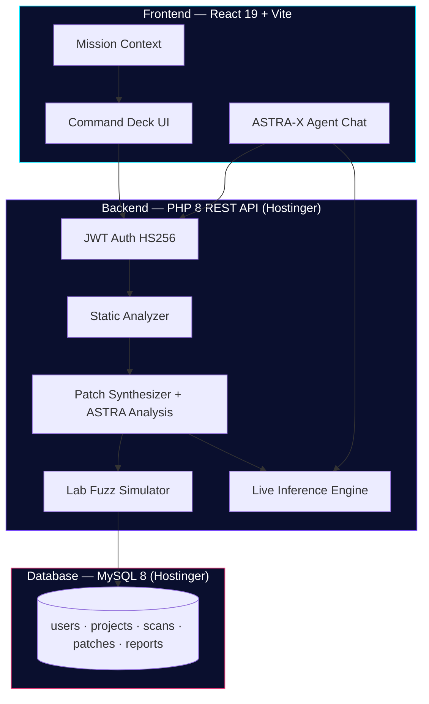

<div align="center">

# 🛡️ ASTRA-X

### Autonomous Security Tactical Reasoning Agent

**Defence-grade AI command platform for Kavach 2026 — Indian Army Cyber Demonstration**

[](https://astra-x-ai-kavach-2026.vercel.app/)
[](https://tan-hummingbird-842514.hostingersite.com/health.php)
[](https://react.dev/)
[](https://vitejs.dev/)
[](https://php.net/)
[](https://tailwindcss.com/)

*Scan · Patch · Certify · Never weaponize*

[🚀 Open Live Demo](https://astra-x-ai-kavach-2026.vercel.app/) · [⚡ Live API](https://tan-hummingbird-842514.hostingersite.com/health.php) · [Reviewer Walkthrough](#-reviewer-walkthrough-5-min) · [API Testing](#-api-testing--curl--postman-reviewer-ready) · [Local Setup](#-local-development)

</div>

---

## ✨ Why ASTRA-X?

ASTRA-X is a **defence-tech command deck** built for **Kavach 2026** reviewers. It demonstrates how an AI copilot can secure mission-critical field software — from digital twin deployment to certified after-action reports — **without ever becoming an offensive toolkit**.

| Principle | What it means |
| --- | --- |
| **Defensive only** | Static analysis, secure rewrites, lab fuzz — no exploit payloads, no live targeting |
| **Twin-first** | Clone field firmware into the Bharat defence mesh before any code ships to theatre |
| **Reviewer-ready** | Full mission loop, cinematic landing, live command deck — works in demo mode without backend |
| **Army-aligned** | CWE mapping, confidence scoring, regression certification aligned with software assurance doctrine |

---

## 🏆 Reviewer Snapshot — Why Select ASTRA-X?

> **One-liner for evaluators:** *ASTRA-X is a full-stack, defence-grade AI command platform that takes mission software from digital twin → CWE scan → secure patch → lab fuzz → certified report — with live JWT auth, MySQL persistence, and an ASTRA-X tactical agent that reads real mission state.*

| What reviewers see in 60 seconds | Proof |
| --- | --- |
| **Live full stack** | Frontend on Vercel + PHP API + MySQL on Hostinger — not a mock-only UI |
| **End-to-end mission loop** | Twin → Scan → Patch → Fuzz → Regression → Report with persistent state |
| **CWE-mapped findings** | Line-numbered vulnerabilities with confidence scores and fix guidance |
| **AI patch analysis** | ASTRA-X explains every rewrite — severity, CWE, reviewer hold tips |
| **Defensive doctrine** | No exploits, no live targeting — aligned with Army software assurance |
| **Zero-install demo** | Login, run mission, open agent chat — works in browser immediately |

**Elevator pitch (30 sec):**

```
Field software reaches theatre only after ASTRA-X clones it into a digital twin,
maps CWE attack classes, synthesizes bounded patches, fuzzes in a lab sandbox,
and certifies five regression suites — all visible to Kavach 2026 evaluators
on a cinematic command deck with live API backing.
```

---

## 🌐 Live Deployments

> **Try the full stack now — no install required**

### Frontend (Command Deck)

| | |
| --- | --- |
| **URL** | [**https://astra-x-ai-kavach-2026.vercel.app/**](https://astra-x-ai-kavach-2026.vercel.app/) |
| **Clearance ID** | `operator@astra.mil` |
| **Passphrase** | `AstraX#2026` |

### Backend (REST API + MySQL)

| | |
| --- | --- |
| **Base URL** | [**https://tan-hummingbird-842514.hostingersite.com**](https://tan-hummingbird-842514.hostingersite.com) |
| **Health check** | [health.php](https://tan-hummingbird-842514.hostingersite.com/health.php) |
| **API index** | [index.php](https://tan-hummingbird-842514.hostingersite.com/index.php) |
| **Database** | MySQL 8 on Hostinger — users, projects, scans, patches, reports |
| **Status** | `"status": "ready"` when DB + tables are linked |

The Vercel frontend is wired to this live API. Login issues real JWT tokens; scan, patch, and fuzz results persist to MySQL.

---

## 🧪 API Testing — curl & Postman (Reviewer Ready)

> **Copy-paste these to verify the full stack in under 2 minutes.**

**Base URL:** `https://tan-hummingbird-842514.hostingersite.com`

| # | Method | Endpoint | Auth | One-click test |
| --- | --- | --- | --- | --- |
| 1 | `GET` | `/health.php` | — | [Open in browser ↗](https://tan-hummingbird-842514.hostingersite.com/health.php) |
| 2 | `GET` | `/index.php` | — | [Open in browser ↗](https://tan-hummingbird-842514.hostingersite.com/index.php) |
| 3 | `POST` | `/login.php` | — | See curl below |
| 4 | `POST` | `/chat.php` | — | ASTRA-X agent |
| 5 | `POST` | `/explain.php` | — | Patch analysis |
| 6 | `POST` | `/scan.php` | JWT | Static CWE scan |
| 7 | `POST` | `/patch.php` | JWT | Secure rewrite |
| 8 | `POST` | `/fuzz.php` | JWT | Lab fuzz |
| 9 | `POST` | `/regression.php` | JWT | Test suites |
| 10 | `GET` | `/reports.php` | JWT | Mission reports |

### Option A — One-command full mission test

```bash
git clone https://github.com/your-org/astra-x-ai-kavach-2026.git
cd astra-x-ai-kavach-2026
./scripts/api-smoke-test.sh
```

Runs health → login → chat → scan → patch → fuzz → regression → explain automatically.

### Option B — Postman (recommended for reviewers)

1. Download **[Postman Collection](postman/ASTRA-X-Kavach-2026.postman_collection.json)** + **[Live Environment](postman/ASTRA-X-Live.postman_environment.json)**
2. Postman → **Import** → select both files
3. Select environment **"ASTRA-X Live (Hostinger)"**
4. Run folder **"00 Public"** → then **"01 Mission Loop"**
5. `03 Login` **auto-saves JWT** to the `token` variable for all protected requests

```
postman/
├── ASTRA-X-Kavach-2026.postman_collection.json   ← 12 ready-made requests
└── ASTRA-X-Live.postman_environment.json         ← baseUrl + token variables
```

### Option C — curl step-by-step

**Step 1 — Health (no auth)**

```bash
curl -s "https://tan-hummingbird-842514.hostingersite.com/health.php"
```

**Step 2 — Login & save token**

```bash
curl -s -X POST "https://tan-hummingbird-842514.hostingersite.com/login.php" \
  -H "Content-Type: application/json" \
  -d '{"email":"operator@astra.mil","password":"AstraX#2026"}'
```

Copy the `token` value, then export it:

```bash
export TOKEN="paste-jwt-token-here"
```

**Step 3 — ASTRA-X agent (no auth)**

```bash
curl -s -X POST "https://tan-hummingbird-842514.hostingersite.com/chat.php" \
  -H "Content-Type: application/json" \
  -d '{
    "message": "Kavach 2026 mission brief",
    "context": { "isAuthed": true, "pathname": "/dashboard" }
  }'
```

**Step 4 — Static scan (JWT)**

```bash
curl -s -X POST "https://tan-hummingbird-842514.hostingersite.com/scan.php" \
  -H "Content-Type: application/json" \
  -H "Authorization: Bearer $TOKEN" \
  -d '{
    "fileName": "api_gateway.js",
    "language": "javascript",
    "code": "const {exec}=require(\"child_process\");\nfunction render(u){document.getElementById(\"b\").innerHTML=u;}\nfunction run(h){exec(\"ping -c 1 \"+h);}\nfunction load(r){return eval(\"(\"+r+\")\");}"
  }'
```

**Step 5 — Secure patch + ASTRA analysis (JWT)**

```bash
curl -s -X POST "https://tan-hummingbird-842514.hostingersite.com/patch.php" \
  -H "Content-Type: application/json" \
  -H "Authorization: Bearer $TOKEN" \
  -d '{
    "language": "javascript",
    "project_id": 1,
    "code": "function load(r){return eval(\"(\"+r+\")\");}\nfunction render(u){document.getElementById(\"b\").innerHTML=u;}"
  }'
```

**Step 6 — Patch explain / ASTRA analysis (no auth)**

```bash
curl -s -X POST "https://tan-hummingbird-842514.hostingersite.com/explain.php" \
  -H "Content-Type: application/json" \
  -d '{
    "language": "javascript",
    "original": "function load(r){ return eval(\"(\"+r+\")\"); }",
    "patched": "function load(r){ return JSON.parse(r); }",
    "notes": ["Removed eval; switched to JSON.parse."],
    "findings": [{ "title": "Dynamic code execution", "cwe": "CWE-95", "severity": "critical" }]
  }'
```

**Step 7 — Lab fuzz (JWT)**

```bash
curl -s -X POST "https://tan-hummingbird-842514.hostingersite.com/fuzz.php" \
  -H "Content-Type: application/json" \
  -H "Authorization: Bearer $TOKEN" \
  -d '{"project_id": 1, "findings": [{"cwe": "CWE-95"}, {"cwe": "CWE-79"}]}'
```

**Step 8 — Regression + reports (JWT)**

```bash
curl -s -X POST "https://tan-hummingbird-842514.hostingersite.com/regression.php" \
  -H "Content-Type: application/json" \
  -H "Authorization: Bearer $TOKEN" \
  -d '{"project_id": 1}'

curl -s "https://tan-hummingbird-842514.hostingersite.com/reports.php" \
  -H "Authorization: Bearer $TOKEN"
```

### Sample responses

**Health (`GET /health.php`):**

```json
{
  "ok": true,
  "service": "ASTRA-X API",
  "status": "ready",
  "checks": {
    "php": "8.3.31",
    "pdo_mysql": true,
    "database": true,
    "tables_ok": true,
    "uploads_writable": true
  }
}
```

**Login (`POST /login.php`):**

```json
{
  "ok": true,
  "user": {
    "id": 1,
    "name": "Operator",
    "email": "operator@astra.mil",
    "role": "COMMAND"
  },
}
```

**Scan findings (`POST /scan.php`):**

```json
{
  "ok": true,
  "findings": [
    {
      "id": "VULN-013",
      "title": "Dynamic code execution",
      "cwe": "CWE-95",
      "severity": "critical",
      "risk": 98,
      "confidence": 0.97,
      "line": 4
    }
  ],
  "score": 12,
  "scanId": 3,
  "projectId": 2
}
```

---

## 🎯 Reviewer Walkthrough (5 min)

Follow this path to evaluate the platform end-to-end:

```
Landing → Login → Digital Twin → Scan → Patch → Fuzz → Regression → Reports
```

| Step | Route | What to look for |
| --- | --- | --- |
| **1. Mission briefing** | `/` | Cinematic boot sequence, India mesh map, 3D holographic shield, theatre command nodes |
| **2. Operator login** | `/login` | Pre-filled demo credentials, JWT auth with offline fallback |
| **3. Command deck** | `/dashboard` | Live threat radar, Indo-Pac attack fabric, AI confidence gauge, mission timeline |
| **4. Digital twin** | `/twin` | Arm a contested system (Secure Comms, Drone Parser, Logistics API) |
| **5. Static scan** | `/scan` | Upload source or load sample — CWE findings with line numbers and risk scores |
| **6. Secure patch** | `/patch` | Split-screen before/after rewrite — **ASTRA-X analysis** cards with CWE, severity, reviewer tips |
| **7. Lab fuzz** | `/fuzz` | Before vs after attack-surface simulation in sandbox |
| **8. Regression** | `/regression` | Five tactical test suites lock green |
| **9. After-action** | `/reports` | Restricted mission dossier with certificate ID |
| **Judge mode** | `/judge` | Evaluator checklist, comparison matrix, architecture, vuln cards |
| **Evidence SOC** | `/evidence` | MITRE/OWASP mapping, severity charts, attack timeline |
| **Twin simulation** | `/simulation` | Defence network topology — click nodes for AI reasoning |
| **Demo script** | `/demo` | 90-second walkthrough timeline + narrator script |

**Emergency incident:** On landing, click **Incident Sim** for a 30-second cyberattack → detect → patch → restore animation.

**Bonus:** Open the **ASTRA-X agent chat** (bottom-right) and ask *"Mission status"*, *"What is next?"*, or *"Kavach 2026 brief"* — live tactical inference reads your mission context.

**Impress evaluators with this patch analysis snippet** (after Scan → Patch on JavaScript sample):

```json
{
  "summary": "ASTRA-X closed four critical attack surfaces in the API gateway corpus — dynamic code execution, DOM XSS, shell injection, and SQL interpolation — reducing exploitable paths before lab fuzz.",
  "items": [
    {
      "title": "Neutralized dynamic code execution",
      "cwe": "CWE-95",
      "severity": "critical",
      "change": "eval(raw) → JSON.parse(safePayload)",
      "detail": "Removed arbitrary JavaScript execution from config ingest. Attacker-controlled strings can no longer execute in the runtime context.",
      "reviewerTip": "Verify all config payloads are schema-validated before parse."
    }
  ]
}
```

---

## 🔄 Mission Loop


1. **Launch Mission** — Operator authenticates with Army Cyber Command clearance  
2. **Digital Twin** — Clone field unit firmware into the Bharat defence mesh  
3. **Scan** — Pattern engine maps CWE classes (buffer overflow, command injection, format string, SQLi, deserialization)  
4. **Patch** — Bounded secure rewrite removes exec paths; risk score drops  
5. **Fuzz** — Lab-only attack-surface simulation before and after hardening  
6. **Tests** — Five tactical regression suites certify the build  
7. **Reports** — Restricted after-action dossier with mission certificate  

---

## 🖥️ Frontend Highlights

Built as a **military cyber operations deck** — not a generic dashboard.

| Feature | Technology | Description |
| --- | --- | --- |
| **Holographic shield** | React Three Fiber | 3D rotating defence shield on landing |
| **Threat radar** | Canvas + SVG | Live sweep with tracked inbound signatures |
| **Attack fabric map** | Custom viz | Indo-Pac hop arcs converging on Bharat HQ |
| **India command mesh** | Interactive map | 8 theatre nodes — Delhi, Mumbai, Hyderabad, Bengaluru, Chennai, Kolkata, Guwahati, Ahmedabad |
| **Glass HUD panels** | Tailwind CSS 4 | Ultra-dark void UI with neon telemetry |
| **Motion system** | GSAP + Framer Motion | Magnetic controls, page transitions, scroll cinematics |
| **Mission strip** | React Context | Persistent progress bar with next-action highlighting |
| **ASTRA-X Agent** | Live inference + rule fallback | Context-aware chat — mission status, patch guidance, Kavach briefings |
| **Particle field** | Canvas | Ambient cyber atmosphere across all routes |

**Supported scan languages:** C · C++ · Python · Java · JavaScript

---

## 🏗️ Architecture



---

## 🛠️ Tech Stack

| Layer | Technologies |
| --- | --- |
| **Frontend** | React 19, Vite 8, Tailwind CSS 4, Framer Motion, GSAP, React Three Fiber, Recharts, Lucide |
| **Backend** | PHP 8 REST API, PDO, JWT (HS256) |
| **Database** | MySQL 8 |
| **Deploy** | [Vercel](https://astra-x-ai-kavach-2026.vercel.app/) (frontend) · [Hostinger](https://tan-hummingbird-842514.hostingersite.com/) (API + MySQL) |
| **AI** | ASTRA-X live inference — agent chat + patch analysis (server-side only) |

---

## ⚡ Quick Start (Demo UI)

The command deck is **fully usable without PHP**. Login falls back to a local demo session if the API is offline.

```bash
git clone https://github.com/your-org/astra-x-ai-kavach-2026.git
cd astra-x-ai-kavach-2026/frontend
npm install
npm run dev
```

Open [http://localhost:5173](http://localhost:5173) and sign in with:

| Field | Value |
| --- | --- |
| Clearance ID | `operator@astra.mil` |
| Passphrase | `AstraX#2026` |

---

## 🔧 Full Stack Setup (Backend)

### 1. Database

```bash
mysql -u root < database/schema.sql
```

### 2. Secrets

```bash
cp backend/config/secrets.example.php backend/config/secrets.php
# Edit secrets.php with DB credentials and JWT secret
```

### 3. Seed demo operator

```bash
php database/seed.php
```

### 4. Serve the API

```bash
cd backend
php -S localhost:8000
```

Vite proxies `/api/*` → `http://localhost:8000` automatically.

### Hostinger production (live)

| Resource | URL |
| --- | --- |
| **API base** | `https://tan-hummingbird-842514.hostingersite.com` |
| **Health** | `GET /health.php` |
| **Login** | `POST /login.php` |
| **Scan / Patch / Fuzz** | JWT-authenticated endpoints |
| **Agent chat** | `POST /chat.php` |
| **Patch analysis** | `POST /explain.php` |

Deploy package: `./scripts/package-hostinger.sh` → upload `dist/astra-x-backend-hostinger.zip` to `public_html/`.  
Full guide: [`backend/DEPLOY-HOSTINGER.md`](backend/DEPLOY-HOSTINGER.md)

### Local development

```bash
# Point frontend to live Hostinger API (already in frontend/.env.production)
VITE_API_URL=https://tan-hummingbird-842514.hostingersite.com

# Or run backend locally
cd backend && php -S localhost:8000
# Set VITE_API_URL=/api in frontend/.env.local
```

**XAMPP alternative:** Copy `backend/` into `htdocs/`, import `database/schema.sql`, set `VITE_API_URL` accordingly.

---

## 📡 API Reference

| Method | Endpoint | Auth | Purpose |
| --- | --- | --- | --- |
| `POST` | `/register.php` | Public | Operator registration |
| `POST` | `/login.php` | Public | JWT issuance |
| `POST` | `/upload.php` | JWT | Source file ingest |
| `POST` | `/scan.php` | JWT | Static CWE analysis |
| `POST` | `/patch.php` | JWT | Secure rewrite synthesis + ASTRA-X analysis |
| `POST` | `/explain.php` | Public | Tactical patch explanation (CWE, severity, reviewer tips) |
| `POST` | `/fuzz.php` | JWT | Lab fuzz simulation |
| `POST` | `/regression.php` | JWT | Tactical test suites |
| `GET/POST` | `/reports.php` | JWT | After-action dossier |
| `GET` | `/health.php` | Public | API + database readiness |
| `POST` | `/chat.php` | Public | ASTRA-X agent — live inference |

All mutating queries use **PDO prepared statements**.

---

## 🔒 Security & Defensive Doctrine

ASTRA-X is designed for **demonstration and evaluation**, not offensive operations:

- ✅ Static pattern analysis mapped to **CWE taxonomy**
- ✅ Bounded secure rewrites with confidence and risk reduction metrics
- ✅ **Lab-only** fuzz and regression — sandbox hold, no live targets
- ✅ JWT-authenticated API with prepared statements
- ❌ No exploit payload generation
- ❌ No live system targeting
- ❌ No weaponization pathways

---

## 📁 Project Structure

```
astra-x-ai-kavach-2026/
├── frontend/                 # React command deck (Vercel deploy)
│   ├── src/
│   │   ├── pages/            # Landing, Dashboard, Scan, Patch, Fuzz, Reports…
│   │   ├── components/       # HUD, effects, dashboard widgets, agent chat
│   │   ├── context/          # Auth + Mission state
│   │   ├── lib/              # Mission loop + agent brain
│   │   └── data/             # Landing copy, mock telemetry, samples
│   └── public/samples/       # comms_gateway.c, drone_parser.py, api_gateway.js
├── backend/                  # PHP 8 REST API (Hostinger deploy)
│   ├── includes/             # Analyzer, AI inference, helpers
│   └── config/               # Database + secrets
├── database/                 # schema.sql, schema-hostinger.sql, seed.php
├── postman/                  # Postman collection + environment (reviewer import)
├── scripts/                  # package-hostinger.sh, api-smoke-test.sh
└── .env.example              # Environment template
```

---

## 🎨 Design System

| Token | Value | Usage |
| --- | --- | --- |
| Void | `#050816` | Page background |
| Cyan | `#00E5FF` | Primary accent, radar, uplink |
| Violet | `#7C4DFF` | Secondary accent, mesh nodes |
| Magenta | `#FF4081` | Alerts, attack arcs |
| Yellow | `#FFD740` | Badges, certification |

**Typography:** Orbitron (display) · Space Grotesk (headings) · Inter (body)

**Motion:** GSAP magnetic controls · Framer page transitions · Canvas particles · SVG radar sweep · R3F holographic shield

---

## 📜 Scripts

```bash
cd frontend
npm run dev       # Start command deck (localhost:5173)
npm run build     # Production bundle
npm run preview   # Serve production build locally
npm run lint      # Oxlint
```

---

## 🏅 Kavach 2026 Context

ASTRA-X demonstrates the **Bharat Defence Mesh** concept — eight theatre command nodes exercising every build before field software reaches Northern, Western, Southern, or Eastern Command sectors.

| Theatre | HQ | Status |
| --- | --- | --- |
| Northern Command | Udhampur | ARMED |
| Western Command | Chandimandir | SYNC |
| Southern Command | Pune | HOLD |
| Eastern Command | Kolkata | GREEN |

> *"Twin first, deploy never blind."*

---

<div align="center">

**Built for Kavach 2026 · Indian Army Cyber Demonstration**

[🌐 Live Demo](https://astra-x-ai-kavach-2026.vercel.app/) · [⚡ Live API](https://tan-hummingbird-842514.hostingersite.com/health.php) · [About ASTRA-X](https://astra-x-ai-kavach-2026.vercel.app/about)

*Defensive hold only. Lab sandbox. No live targeting.*

</div>
