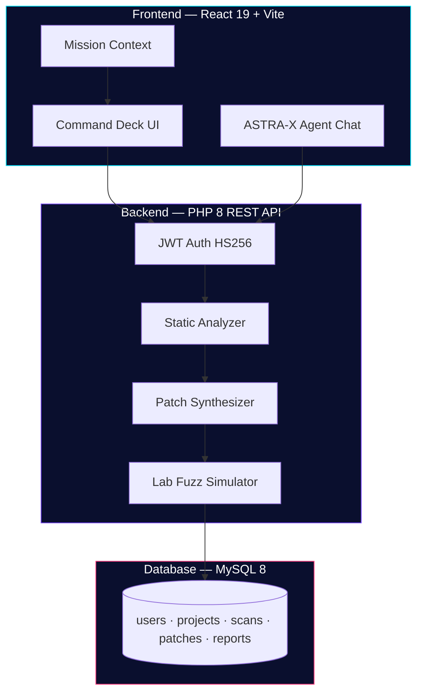

<div align="center">

# 🛡️ ASTRA-X

### Autonomous Security Tactical Reasoning Agent

**Defence-grade AI command platform for Kavach 2026 — Indian Army Cyber Demonstration**

[](https://astra-x-ai-kavach-2026.vercel.app/)
[](https://react.dev/)
[](https://vitejs.dev/)
[](https://php.net/)
[](https://tailwindcss.com/)

*Scan · Patch · Certify · Never weaponize*

[🚀 Open Live Demo](https://astra-x-ai-kavach-2026.vercel.app/) · [Reviewer Walkthrough](#-reviewer-walkthrough-5-min) · [Local Setup](#-local-development)

</div>

---

## ✨ Why ASTRA-X?

ASTRA-X is a **defence-tech command deck** built for **Kavach 2026** reviewers. It demonstrates how an AI copilot can secure mission-critical field software — from digital twin deployment to certified after-action reports — **without ever becoming an offensive toolkit**.

| Principle | What it means |
| --- | --- |
| **Defensive only** | Static analysis, secure rewrites, lab fuzz — no exploit payloads, no live targeting |
| **Twin-first** | Clone field firmware into the Bharat defence mesh before any code ships to theatre |
| **Reviewer-ready** | Full mission loop, cinematic landing, live command deck — works in demo mode without backend |
| **Army-aligned** | CWE mapping, confidence scoring, regression certification aligned with software assurance doctrine |

---

## 🌐 Live Frontend Deploy

> **Try it now — no install required**

| | |
| --- | --- |
| **URL** | [**https://astra-x-ai-kavach-2026.vercel.app/**](https://astra-x-ai-kavach-2026.vercel.app/) |
| **Clearance ID** | `operator@astra.mil` |
| **Passphrase** | `AstraX#2026` |

The deployed frontend runs the **full command deck UI** with demo fallback when the PHP API is offline. Login, mission loop, visualizations, and the ASTRA-X agent chat all work out of the box.

---

## 🎯 Reviewer Walkthrough (5 min)

Follow this path to evaluate the platform end-to-end:

```
Landing → Login → Digital Twin → Scan → Patch → Fuzz → Regression → Reports
```

| Step | Route | What to look for |
| --- | --- | --- |
| **1. Mission briefing** | `/` | Cinematic boot sequence, India mesh map, 3D holographic shield, theatre command nodes |
| **2. Operator login** | `/login` | Pre-filled demo credentials, JWT auth with offline fallback |
| **3. Command deck** | `/dashboard` | Live threat radar, Indo-Pac attack fabric, AI confidence gauge, mission timeline |
| **4. Digital twin** | `/twin` | Arm a contested system (Secure Comms, Drone Parser, Logistics API) |
| **5. Static scan** | `/scan` | Upload source or load sample — CWE findings with line numbers and risk scores |
| **6. Secure patch** | `/patch` | Split-screen before/after rewrite with confidence and risk reduction |
| **7. Lab fuzz** | `/fuzz` | Before vs after attack-surface simulation in sandbox |
| **8. Regression** | `/regression` | Five tactical test suites lock green |
| **9. After-action** | `/reports` | Restricted mission dossier with certificate ID |

**Bonus:** Open the **ASTRA-X agent chat** (bottom-right) and ask *"Mission status"*, *"What is next?"*, or *"Kavach 2026 brief"*.

---

## 🔄 Mission Loop


1. **Launch Mission** — Operator authenticates with Army Cyber Command clearance  
2. **Digital Twin** — Clone field unit firmware into the Bharat defence mesh  
3. **Scan** — Pattern engine maps CWE classes (buffer overflow, command injection, format string, SQLi, deserialization)  
4. **Patch** — Bounded secure rewrite removes exec paths; risk score drops  
5. **Fuzz** — Lab-only attack-surface simulation before and after hardening  
6. **Tests** — Five tactical regression suites certify the build  
7. **Reports** — Restricted after-action dossier with mission certificate  

---

## 🖥️ Frontend Highlights

Built as a **military cyber operations deck** — not a generic dashboard.

| Feature | Technology | Description |
| --- | --- | --- |
| **Holographic shield** | React Three Fiber | 3D rotating defence shield on landing |
| **Threat radar** | Canvas + SVG | Live sweep with tracked inbound signatures |
| **Attack fabric map** | Custom viz | Indo-Pac hop arcs converging on Bharat HQ |
| **India command mesh** | Interactive map | 8 theatre nodes — Delhi, Mumbai, Hyderabad, Bengaluru, Chennai, Kolkata, Guwahati, Ahmedabad |
| **Glass HUD panels** | Tailwind CSS 4 | Ultra-dark void UI with neon telemetry |
| **Motion system** | GSAP + Framer Motion | Magnetic controls, page transitions, scroll cinematics |
| **Mission strip** | React Context | Persistent progress bar with next-action highlighting |
| **ASTRA-X Agent** | Rule engine + optional LLM | Context-aware chat guiding reviewers through the loop |
| **Particle field** | Canvas | Ambient cyber atmosphere across all routes |

**Supported scan languages:** C · C++ · Python · Java

---

## 🏗️ Architecture



---

## 🛠️ Tech Stack

| Layer | Technologies |
| --- | --- |
| **Frontend** | React 19, Vite 8, Tailwind CSS 4, Framer Motion, GSAP, React Three Fiber, Recharts, Lucide |
| **Backend** | PHP 8 REST API, PDO, JWT (HS256) |
| **Database** | MySQL 8 |
| **Deploy** | Vercel (frontend) · XAMPP / PHP built-in server (API) |
| **Optional AI** | OpenAI integration for live agent replies via `ASTRA_OPENAI_KEY` |

---

## ⚡ Quick Start (Demo UI)

The command deck is **fully usable without PHP**. Login falls back to a local demo session if the API is offline.

```bash
git clone https://github.com/your-org/astra-x-ai-kavach-2026.git
cd astra-x-ai-kavach-2026/frontend
npm install
npm run dev
```

Open [http://localhost:5173](http://localhost:5173) and sign in with:

| Field | Value |
| --- | --- |
| Clearance ID | `operator@astra.mil` |
| Passphrase | `AstraX#2026` |

---

## 🔧 Full Stack Setup (Backend)

### 1. Database

```bash
mysql -u root < database/schema.sql
```

### 2. Secrets

```bash
cp backend/config/secrets.example.php backend/config/secrets.php
# Edit secrets.php with DB credentials and JWT secret
```

### 3. Seed demo operator

```bash
php database/seed.php
```

### 4. Serve the API

```bash
cd backend
php -S localhost:8000
```

Vite proxies `/api/*` → `http://localhost:8000` automatically.

### XAMPP alternative

- Copy `backend/` into `htdocs/astra-x/`
- Import `database/schema.sql` via phpMyAdmin
- Set `VITE_API_URL=http://localhost/astra-x` in `frontend/.env`

---

## 📡 API Reference

| Method | Endpoint | Auth | Purpose |
| --- | --- | --- | --- |
| `POST` | `/register.php` | Public | Operator registration |
| `POST` | `/login.php` | Public | JWT issuance |
| `POST` | `/upload.php` | JWT | Source file ingest |
| `POST` | `/scan.php` | JWT | Static CWE analysis |
| `POST` | `/patch.php` | JWT | Secure rewrite synthesis |
| `POST` | `/fuzz.php` | JWT | Lab fuzz simulation |
| `POST` | `/regression.php` | JWT | Tactical test suites |
| `GET/POST` | `/reports.php` | JWT | After-action dossier |
| `POST` | `/chat.php` | Public | ASTRA-X agent (optional OpenAI) |

All mutating queries use **PDO prepared statements**.

---

## 🔒 Security & Defensive Doctrine

ASTRA-X is designed for **demonstration and evaluation**, not offensive operations:

- ✅ Static pattern analysis mapped to **CWE taxonomy**
- ✅ Bounded secure rewrites with confidence and risk reduction metrics
- ✅ **Lab-only** fuzz and regression — sandbox hold, no live targets
- ✅ JWT-authenticated API with prepared statements
- ❌ No exploit payload generation
- ❌ No live system targeting
- ❌ No weaponization pathways

---

## 📁 Project Structure

```
astra-x-ai-kavach-2026/
├── frontend/                 # React command deck (Vercel deploy)
│   ├── src/
│   │   ├── pages/            # Landing, Dashboard, Scan, Patch, Fuzz, Reports…
│   │   ├── components/       # HUD, effects, dashboard widgets, agent chat
│   │   ├── context/          # Auth + Mission state
│   │   ├── lib/              # Mission loop + agent brain
│   │   └── data/             # Landing copy, mock telemetry, samples
│   └── public/samples/       # comms_gateway.c, drone_parser.py
├── backend/                  # PHP 8 REST API
│   ├── includes/             # Analyzer, helpers
│   └── config/               # Database + secrets
├── database/                 # schema.sql + seed.php
└── .env.example              # Environment template
```

---

## 🎨 Design System

| Token | Value | Usage |
| --- | --- | --- |
| Void | `#050816` | Page background |
| Cyan | `#00E5FF` | Primary accent, radar, uplink |
| Violet | `#7C4DFF` | Secondary accent, mesh nodes |
| Magenta | `#FF4081` | Alerts, attack arcs |
| Yellow | `#FFD740` | Badges, certification |

**Typography:** Orbitron (display) · Space Grotesk (headings) · Inter (body)

**Motion:** GSAP magnetic controls · Framer page transitions · Canvas particles · SVG radar sweep · R3F holographic shield

---

## 📜 Scripts

```bash
cd frontend
npm run dev       # Start command deck (localhost:5173)
npm run build     # Production bundle
npm run preview   # Serve production build locally
npm run lint      # Oxlint
```

---

## 🏅 Kavach 2026 Context

ASTRA-X demonstrates the **Bharat Defence Mesh** concept — eight theatre command nodes exercising every build before field software reaches Northern, Western, Southern, or Eastern Command sectors.

| Theatre | HQ | Status |
| --- | --- | --- |
| Northern Command | Udhampur | ARMED |
| Western Command | Chandimandir | SYNC |
| Southern Command | Pune | HOLD |
| Eastern Command | Kolkata | GREEN |

> *"Twin first, deploy never blind."*

---

<div align="center">

**Built for Kavach 2026 · Indian Army Cyber Demonstration**

[🌐 Live Demo](https://astra-x-ai-kavach-2026.vercel.app/) · [About ASTRA-X](https://astra-x-ai-kavach-2026.vercel.app/about)

*Defensive hold only. Lab sandbox. No live targeting.*

</div>
